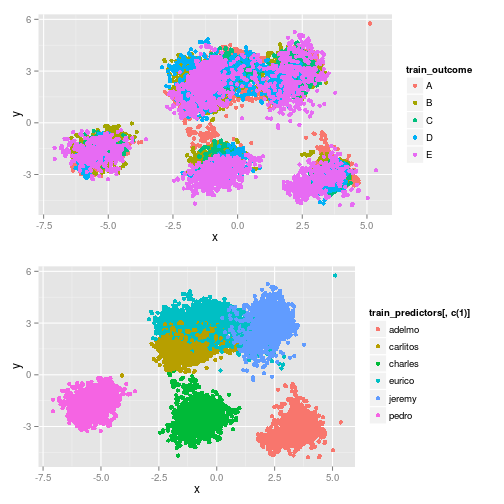

# Weight Lifting Exercise analysis
This project is about building model to determine how well people perform barbell lifts with data from their wearning sensors; Training data came from accelerometers on the belt, forearm, arm, and dumbell of 6 participants, which is collected from (this source)[http://groupware.les.inf.puc-rio.br/har]. The accuracy of my model -- built by using PCA with threshold 95% and Random Forest -- is about 96.8% on training dataset and *98 % for validation set*, and *95% on 19/20 testing set*.
## Setting up required library and preparing data

```r
library(caret)
```

```
## Loading required package: lattice
## Loading required package: ggplot2
```

```r
library(VIM)
```

```
## Loading required package: colorspace
## Loading required package: grid
## VIM is ready to use. 
##  Since version 4.0.0 the GUI is in its own package VIMGUI.
## 
##           Please use the package to use the new (and old) GUI.
## 
## 
## Attaching package: 'VIM'
## 
## The following object is masked from 'package:datasets':
## 
##     sleep
```

```r
library(gridExtra)
library(knitr)
library(doMC)
```

```
## Loading required package: foreach
## Loading required package: iterators
## Loading required package: parallel
```

```r
registerDoMC(cores=2) # For paralell random forest
opts_chunk$set(cache=TRUE,echo=TRUE)
```
Make sure that you have download follwing files from below links for running this script (must put these files in same folder as this script)
Training set [here](https://d396qusza40orc.cloudfront.net/predmachlearn/pml-training.csv)
Testing set [here](https://d396qusza40orc.cloudfront.net/predmachlearn/pml-testing.csv)

```r
set.seed(12345)
orgData <- read.csv("pml-training.csv")
orgTest <- read.csv("pml-testing.csv")
```

## Exploratory analysis

```r
names(orgData)
```
Many varibles, many are statistical purpose variable which giving something like summary of given sensors data within time window. It maybe use to fix the noise of data given by sensors, but to simplify, now just removing it from analysis

```r
ignored_column_regx <- "^(kurtosis|skewness|min|max|stddev|total|var|avg|ampl)"
data <- orgData[,grep(ignored_column_regx,names(orgData),invert=T)]
```

Next, checking for uncompleted data

```r
table(complete.cases(data))
```

```
## 
##  TRUE 
## 19622
```
None, so can continue without dealing with imputing. If go backward and plugging in statistical variables above, I see that almost cases(nearly 97%) are incomplete leading to some serious working in imputing

```r
a <- aggr(orgData,plot=F)
#summary(a)
table(a$missings$Count)
```

```
## 
##     0 19216 
##    93    67
```
Some variables can also be removed:
- New window `yes` mean it ist time to calculate statistical variables, we remove all stat vars
- so can also ignore this variable
- user_name contains user name, our output model should be apply to any other user regardless of their name; So also ignore this variable.
- cvtd_timestamp is timestamp but in another form so it can be removed
- X and num_window show the order, I assume that sensor device work stable regarless of how long it run.
I notice that timestamp should be kept because at night the activity of body may go down and it related to the how they do.
### Create training dataset and validation dataset

```r
data <- data[,grep("^(num_window|cvtd_timestamp|X|new_window)",names(data),invert=T)]
inTraining <- createDataPartition(y=data$classe,p=.75,list=F) 
training <- data[inTraining,]
validation <- data[-inTraining,]

train_predictors <- training[,-c(52)]
train_outcome <- training[,c(52)]

validation_pred <- validation[,-c(52)]
validation_outcome <- validation[,c(52)]
```
### Continue exploratory analysis
Now exploring how classes are seperated by 2d plot

```r
train_predictors_scaled <- scale(train_predictors[,c(-1)],center=T,scale=T)
pc <- prcomp(train_predictors_scaled) 
cumsum((pc$sdev^2 / sum(pc$sdev^2))) # First 2 exlain only (30% variance), but just exlore to see any pattern heres ?
```

```
##  [1] 0.1593 0.3080 0.4020 0.4877 0.5623 0.6200 0.6637 0.7014 0.7341 0.7624
## [11] 0.7856 0.8057 0.8255 0.8443 0.8605 0.8766 0.8913 0.9031 0.9141 0.9241
## [21] 0.9334 0.9410 0.9483 0.9551 0.9608 0.9660 0.9706 0.9746 0.9779 0.9809
## [31] 0.9835 0.9859 0.9879 0.9896 0.9911 0.9924 0.9935 0.9946 0.9953 0.9961
## [41] 0.9967 0.9973 0.9979 0.9984 0.9988 0.9993 0.9996 0.9998 1.0000 1.0000
```

```r
training_predictors_pc12 <- as.matrix(train_predictors_scaled) %*% pc$rotation[,c(1,2)]
training_predictors_pc12 <- data.frame(x=training_predictors_pc12[,1],y=training_predictors_pc12[,2])
q1<-qplot(data=training_predictors_pc12,x=x,y=y,col=train_outcome)
q2<-qplot(data=training_predictors_pc12,x=x,y=y,col=train_predictors[,c(1)])
grid.arrange(q1,q2)
```

 

It seem that first 2 layer of PCA  only seperate 6 people quite well , but not sure how to seperate how they do.

## Machine learning
Use PCA to reduce complexity before training

```r
train_predictors <- training[,-c(1,52)]
train_outcome <- training[,c(52)]
```
PCA with Centering and Scaleing togother because of timestamp are very big value and I will use 

```r
preProcess <- preProcess(train_predictors,method=c("center","scale","pca"),thresh=.95)
# Preprocess training and validation set
train_pred_preprocessed <- predict(preProcess,train_predictors)
validation_pred_preprocessed <- predict(preProcess,validation_pred[,-c(1)])
```
Cross-validation with 3 fold, and allow running for paralell for shorten time

```r
myCtrl <- trainControl(method="cv",number=3,allowParallel=T)
```
Now use tree to classify

```r
sepTree <- train(train_outcome~.,method="rpart",data=train_pred_preprocessed,trControl=myCtrl)
sepTree$results 
```

```
##        cp Accuracy   Kappa AccuracySD KappaSD
## 1 0.01728   0.3983 0.18869   0.007168 0.01192
## 2 0.03997   0.3857 0.16868   0.014483 0.02470
## 3 0.06579   0.3155 0.05206   0.053960 0.09016
```
Only 39% accuracy, so need more powerful model. Try lda:

```r
sepLda <- train(train_outcome~.,method="lda",data=train_pred_preprocessed,trControl=myCtrl)
sepLda$results
```

```
##   parameter Accuracy  Kappa AccuracySD KappaSD
## 1      none   0.5191 0.3891    0.01263 0.01682
```
Nearly 52%, a little bit better but not enough. Try more powerful model, random forest

```r
sepRF <- train(train_outcome~.,data=train_pred_preprocessed,method="rf",trControl=myCtrl,allowParalell=T)
sepRF
```

```
## Random Forest 
## 
## 14718 samples
##    23 predictors
##     5 classes: 'A', 'B', 'C', 'D', 'E' 
## 
## No pre-processing
## Resampling: Cross-Validated (3 fold) 
## 
## Summary of sample sizes: 9811, 9812, 9813 
## 
## Resampling results across tuning parameters:
## 
##   mtry  Accuracy  Kappa  Accuracy SD  Kappa SD
##   2     1         1      0.003        0.004   
##   10    1         1      0.001        0.002   
##   20    1         0.9    0.002        0.002   
## 
## Accuracy was used to select the optimal model using  the largest value.
## The final value used for the model was mtry = 2.
```

```r
confusionMatrix(predict(sepRF,validation_pred_preprocessed),validation_outcome)
```

```
## Confusion Matrix and Statistics
## 
##           Reference
## Prediction    A    B    C    D    E
##          A 1384   15    0    1    0
##          B    5  925   13    2    3
##          C    3    9  840   28    9
##          D    3    0    2  772    3
##          E    0    0    0    1  886
## 
## Overall Statistics
##                                         
##                Accuracy : 0.98          
##                  95% CI : (0.976, 0.984)
##     No Information Rate : 0.284         
##     P-Value [Acc > NIR] : <2e-16        
##                                         
##                   Kappa : 0.975         
##  Mcnemar's Test P-Value : NA            
## 
## Statistics by Class:
## 
##                      Class: A Class: B Class: C Class: D Class: E
## Sensitivity             0.992    0.975    0.982    0.960    0.983
## Specificity             0.995    0.994    0.988    0.998    1.000
## Pos Pred Value          0.989    0.976    0.945    0.990    0.999
## Neg Pred Value          0.997    0.994    0.996    0.992    0.996
## Prevalence              0.284    0.194    0.174    0.164    0.184
## Detection Rate          0.282    0.189    0.171    0.157    0.181
## Detection Prevalence    0.285    0.193    0.181    0.159    0.181
## Balanced Accuracy       0.994    0.984    0.985    0.979    0.992
```
Random forest performance on training set is 96.8% and on validation is 98%. This mean it maybe quite good on out-of-sample error ( based on our validation set performance). No need to justify model more.

## Calculating on test set
Now testing on test set

```r
test_predictors <- orgTest[,names(train_predictors)]
test_predictors_preprocessed <- predict(preProcess,test_predictors)
predict(sepRF,test_predictors_preprocessed)
```

```
##  [1] B A A A A E D B A A B C B A E E A B B B
## Levels: A B C D E
```

```r
# 19/20 right, 1 wrong classify at position 3
```

## Reference
[1] https://class.coursera.org/predmachlearn-003/human_grading/view/courses/972148/assessments/4/submissions

[2] http://groupware.les.inf.puc-rio.br/har
